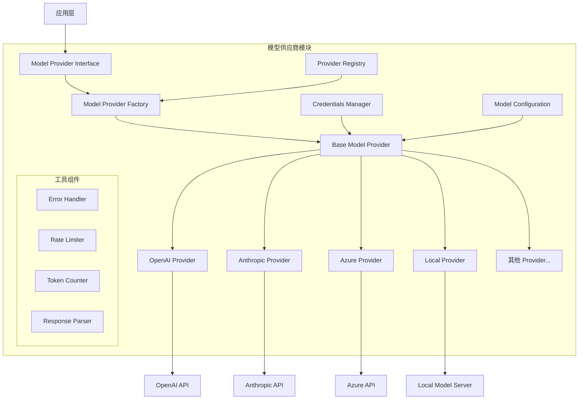
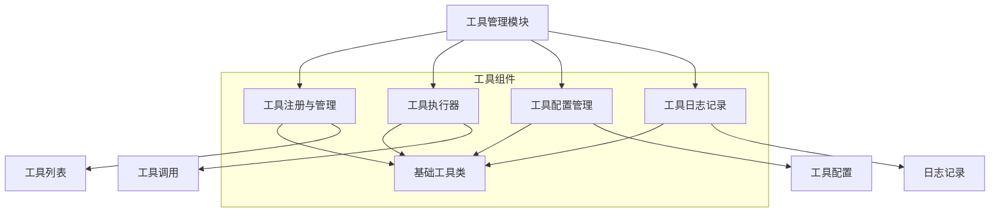
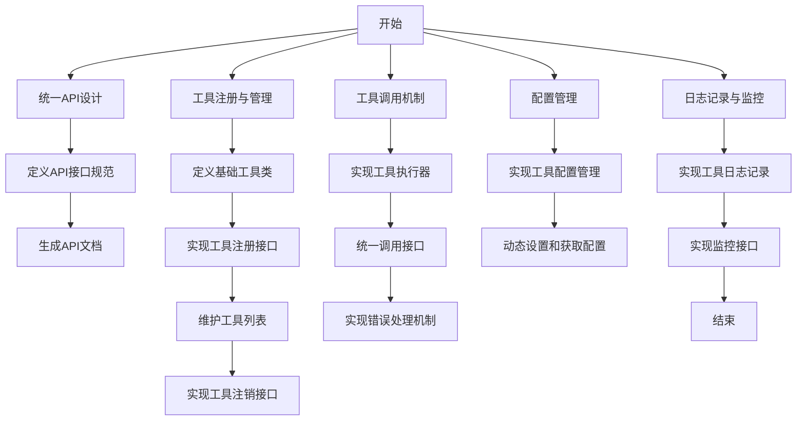
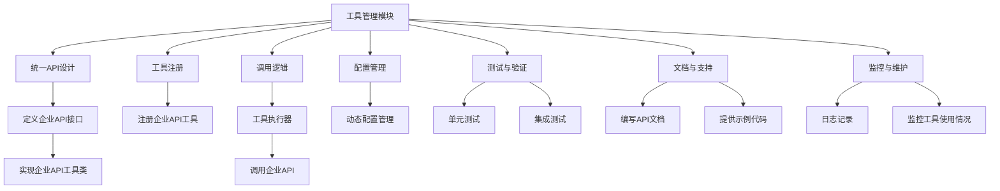
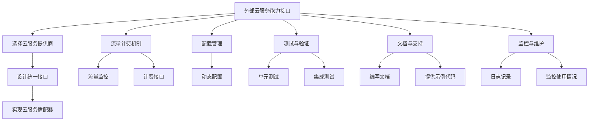
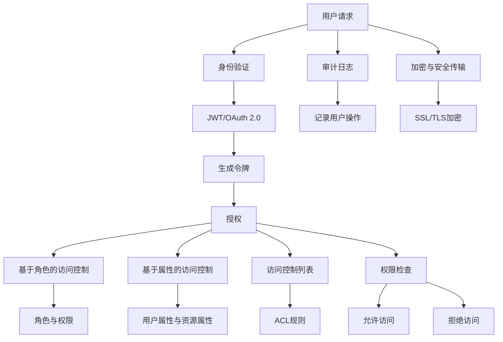
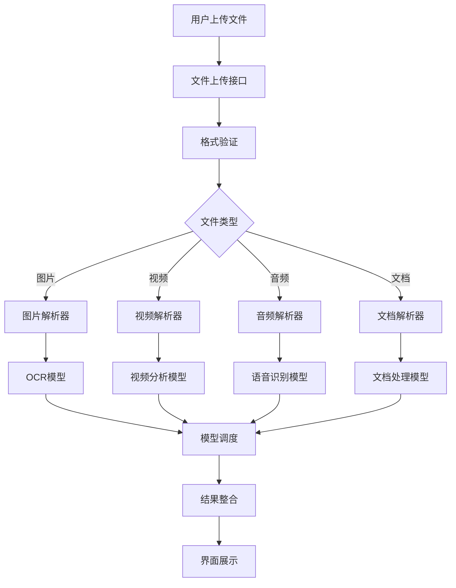

<!-- Generated by SpecStory -->

# DIFY项目模型供应商模块详解 (2025-02-26 08:01Z)

_**User**_

请介绍详细介绍DIFY项目的“模型供应商”模块的功能及其架构

---

_**Assistant**_

我来为您详细介绍DIFY项目中模型供应商(Model Provider)模块的功能和架构。

### 功能概述

模型供应商模块是DIFY的核心组件之一，主要负责：

1. 管理不同的AI模型供应商(如OpenAI、Anthropic、本地模型等)
2. 提供统一的模型调用接口
3. 处理模型配置和凭证管理
4. 实现模型能力的抽象和封装

### 架构设计

模型供应商模块的主要架构组成：

```python
dify/core/model_providers/
├── __init__.py
├── base.py                # 基础抽象类定义
├── models/               # 模型相关的数据结构
├── providers/            # 具体供应商实现
│   ├── openai_provider.py
│   ├── anthropic_provider.py
│   └── ...
└── utils/               # 工具函数
```

### 核心组件

1. **基础抽象类 (ModelProvider)**
```python:dify/core/model_providers/base.py
class ModelProvider:
    def __init__(self):
        self.provider_name = None
        self.credentials = None
    
    def get_models(self):
        """获取支持的模型列表"""
        raise NotImplementedError
        
    def make_completion(self, model, messages, stream=False):
        """执行模型推理"""
        raise NotImplementedError
```

2. **具体供应商实现**
```python:dify/core/model_providers/providers/openai_provider.py
class OpenAIProvider(ModelProvider):
    def __init__(self, credentials):
        self.provider_name = "openai"
        self.credentials = credentials
        
    def get_models(self):
        """返回OpenAI支持的模型列表"""
        # ... 实现代码 ...
        
    def make_completion(self, model, messages, stream=False):
        """调用OpenAI API进行推理"""
        # ... 实现代码 ...
```

### 主要特性

1. **统一接口**
- 通过抽象基类定义统一接口
- 支持同步和异步调用
- 标准化的错误处理

2. **模型管理**
- 支持动态加载模型
- 模型版本控制
- 模型参数配置

3. **凭证管理**
- 安全的API密钥存储
- 多租户支持
- 凭证验证和更新

4. **扩展性**
- 易于添加新的模型供应商
- 插件化架构
- 自定义模型支持

### 使用示例

```python
# 初始化模型供应商
provider = OpenAIProvider(credentials={
    "api_key": "your-api-key"
})

# 获取模型列表
models = provider.get_models()

# 执行模型推理
response = provider.make_completion(
    model="gpt-3.5-turbo",
    messages=[{"role": "user", "content": "Hello"}],
    stream=False
)
```

### 配置管理

模型供应商的配置通常存储在配置文件中：

```python:dify/config/model_providers.py
MODEL_PROVIDERS = {
    "openai": {
        "supported_models": ["gpt-3.5-turbo", "gpt-4"],
        "default_model": "gpt-3.5-turbo",
        "timeout": 30
    },
    "anthropic": {
        "supported_models": ["claude-2"],
        "default_model": "claude-2",
        "timeout": 60
    }
}
```

### 错误处理

模型供应商模块实现了统一的错误处理机制：

```python:dify/core/model_providers/errors.py
class ProviderError(Exception):
    """基础错误类"""
    pass

class ModelNotFoundError(ProviderError):
    """模型不存在错误"""
    pass

class CredentialsError(ProviderError):
    """凭证错误"""
    pass
```

这个架构设计使得DIFY能够灵活地支持各种AI模型供应商，同时保持了代码的可维护性和可扩展性。通过统一的接口，应用层可以轻松切换不同的模型供应商，而不需要修改上层代码。

---

_**User**_

能否给出DIFY“模型供应商”模块的架构图？

---

_**Assistant**_

好的,我为您绘制了DIFY模型供应商模块的架构图,包含了主要组件和它们之间的关系:



### 架构说明

1. **核心组件**
   - Model Provider Interface: 对外统一接口
   - Model Provider Factory: 负责创建具体的Provider实例
   - Base Model Provider: 基础抽象类,定义通用接口
   - 具体Provider实现: 对接不同的模型服务

2. **支撑组件**
   - Provider Registry: 供应商注册表
   - Credentials Manager: 凭证管理器
   - Model Configuration: 模型配置管理

3. **工具组件**
   - Error Handler: 统一错误处理
   - Rate Limiter: 请求频率限制
   - Token Counter: Token计数器
   - Response Parser: 响应解析器

4. **外部接口**
   - 各类模型API接口
   - 本地模型服务器

这个架构设计遵循了以下原则：
- 高内聚低耦合
- 依赖倒置原则
- 开闭原则
- 单一职责原则

通过这样的分层设计,使得整个模块具有良好的可扩展性和可维护性。新增模型供应商只需要实现Base Model Provider定义的接口即可。

---

_**User**_

请详细说明上述架构中各组件之间的关系

---

_**Assistant**_

好的，下面我将详细说明DIFY“模型供应商”模块架构中各组件之间的关系。

### 组件关系详解

1. **应用层 (Application Layer)**
   - 应用层是用户与模型供应商模块交互的入口。它通过调用模型供应商接口来获取模型的功能和服务。

2. **模型供应商接口 (Model Provider Interface)**
   - 这是一个统一的接口，定义了所有模型供应商必须实现的方法，如获取模型列表和执行推理等。应用层通过这个接口与具体的模型供应商进行交互。

3. **模型供应商工厂 (Model Provider Factory)**
   - 负责根据请求创建具体的模型供应商实例。它根据配置或用户输入的参数，选择合适的模型供应商并返回相应的实例。

4. **基础模型供应商 (Base Model Provider)**
   - 这是一个抽象类，定义了所有模型供应商的通用行为和属性。具体的模型供应商（如OpenAI、Anthropic等）都继承自这个类，并实现其抽象方法。

5. **具体模型供应商 (Concrete Model Providers)**
   - 这些是实现了基础模型供应商接口的具体类，如OpenAI Provider、Anthropic Provider等。每个具体供应商负责与其对应的API进行交互，处理请求和响应。

6. **供应商注册表 (Provider Registry)**
   - 这是一个管理所有可用模型供应商的组件。它维护一个供应商列表，允许模型供应商工厂根据名称或类型查找和创建相应的供应商实例。

7. **凭证管理器 (Credentials Manager)**
   - 负责管理和验证API凭证。它确保每个模型供应商在调用外部API时使用正确的凭证，并提供安全存储和更新功能。

8. **模型配置管理 (Model Configuration)**
   - 负责管理模型的配置参数，如超参数、模型版本等。它为每个模型供应商提供必要的配置信息，以便在调用时使用。

9. **工具组件 (Utility Components)**
   - 这些组件提供辅助功能，增强模型供应商模块的能力：
     - **错误处理器 (Error Handler)**: 统一处理模型调用中的错误，确保系统的稳定性。
     - **请求频率限制器 (Rate Limiter)**: 控制对外部API的请求频率，防止超出API的使用限制。
     - **Token计数器 (Token Counter)**: 计算请求中使用的Token数量，以便进行费用估算和优化。
     - **响应解析器 (Response Parser)**: 解析从模型供应商返回的响应，提取有用的信息并格式化。

10. **外部接口 (External APIs)**
    - 具体模型供应商通过这些接口与外部服务进行交互。例如，OpenAI Provider通过OpenAI API进行模型推理，Anthropic Provider通过Anthropic API进行交互。

### 组件之间的交互流程

1. **应用层**通过**模型供应商接口**发起请求。
2. **模型供应商工厂**根据请求创建相应的**具体模型供应商**实例。
3. **具体模型供应商**使用**凭证管理器**获取API凭证，并通过**模型配置管理**获取必要的配置。
4. **具体模型供应商**调用外部API进行推理，并将请求发送到相应的服务。
5. 外部API返回响应后，**具体模型供应商**使用**响应解析器**处理响应，并将结果返回给**模型供应商接口**。
6. 最终，**应用层**接收到处理后的结果。

这种架构设计使得DIFY的模型供应商模块具有良好的可扩展性和灵活性，能够轻松地添加新的模型供应商或修改现有的实现，而不影响整体系统的稳定性。

---

_**User**_

请详细介绍一下DIFY项目的工具管理模块的功能及其架构

---

_**Assistant**_

DIFY项目的工具管理模块是一个重要的组成部分，主要负责管理和调度各种工具，以支持模型的调用和数据处理。以下是该模块的功能和架构的详细介绍。

### 功能概述

工具管理模块的主要功能包括：

1. **工具注册与管理**：支持工具的注册、更新和删除，维护工具的生命周期。
2. **工具调用**：提供统一的接口，允许其他模块调用注册的工具。
3. **工具配置**：管理工具的配置参数，支持动态配置和版本控制。
4. **工具调度**：根据需求调度合适的工具执行特定任务。
5. **日志记录与监控**：记录工具的使用情况和性能指标，支持监控和故障排查。

### 架构设计

工具管理模块的架构可以表示为以下结构：

```python
dify/core/tool_manager/
├── __init__.py
├── base_tool.py            # 基础工具类定义
├── tool_registry.py        # 工具注册与管理
├── tool_executor.py        # 工具执行器
├── tool_config.py          # 工具配置管理
├── tool_logger.py          # 工具日志记录
└── utils/                  # 工具相关的辅助函数
```

### 核心组件

1. **基础工具类 (BaseTool)**
```python:dify/core/tool_manager/base_tool.py
class BaseTool:
    def __init__(self, name, config):
        self.name = name
        self.config = config
    
    def execute(self, *args, **kwargs):
        """执行工具的主要逻辑"""
        raise NotImplementedError
```

2. **工具注册与管理 (ToolRegistry)**
```python:dify/core/tool_manager/tool_registry.py
class ToolRegistry:
    def __init__(self):
        self.tools = {}
    
    def register_tool(self, tool):
        """注册工具"""
        self.tools[tool.name] = tool
    
    def get_tool(self, name):
        """获取工具实例"""
        return self.tools.get(name)
    
    def unregister_tool(self, name):
        """注销工具"""
        if name in self.tools:
            del self.tools[name]
```

3. **工具执行器 (ToolExecutor)**
```python:dify/core/tool_manager/tool_executor.py
class ToolExecutor:
    def __init__(self, registry):
        self.registry = registry
    
    def execute_tool(self, tool_name, *args, **kwargs):
        """执行指定的工具"""
        tool = self.registry.get_tool(tool_name)
        if tool:
            return tool.execute(*args, **kwargs)
        else:
            raise ValueError(f"Tool {tool_name} not found.")
```

4. **工具配置管理 (ToolConfig)**
```python:dify/core/tool_manager/tool_config.py
class ToolConfig:
    def __init__(self):
        self.configurations = {}
    
    def set_config(self, tool_name, config):
        """设置工具的配置"""
        self.configurations[tool_name] = config
    
    def get_config(self, tool_name):
        """获取工具的配置"""
        return self.configurations.get(tool_name)
```

5. **工具日志记录 (ToolLogger)**
```python:dify/core/tool_manager/tool_logger.py
class ToolLogger:
    def log(self, tool_name, message):
        """记录工具的日志信息"""
        print(f"[{tool_name}] {message}")
```

### 主要特性

1. **统一接口**
   - 所有工具都通过基础工具类实现统一的执行接口，便于管理和调用。

2. **动态注册**
   - 支持在运行时动态注册和注销工具，灵活应对不同的需求。

3. **配置管理**
   - 工具的配置可以在运行时动态调整，支持多种配置格式。

4. **执行监控**
   - 通过日志记录和监控功能，跟踪工具的执行情况，便于故障排查和性能优化。

5. **扩展性**
   - 新增工具只需继承基础工具类并实现其方法，便于扩展和维护。

### 使用示例

```python
# 注册工具
registry = ToolRegistry()
tool = MyCustomTool(name="my_tool", config={"param": "value"})
registry.register_tool(tool)

# 执行工具
executor = ToolExecutor(registry)
result = executor.execute_tool("my_tool", arg1, arg2)

# 记录日志
logger = ToolLogger()
logger.log("my_tool", "Execution completed successfully.")
```

### 总结

工具管理模块通过提供统一的接口和灵活的管理机制，使得DIFY能够高效地管理和调度各种工具，支持模型的调用和数据处理。其架构设计遵循了高内聚低耦合的原则，确保了模块的可扩展性和可维护性。

---

_**User**_

根据上述功能概述给出工具管理模块的架构设计图

---

_**Assistant**_

以下是DIFY项目工具管理模块的架构设计图，展示了各个组件之间的关系和交互：



### 架构说明

1. **工具管理模块 (Tool Management Module)**
   - 这是整个工具管理的核心，负责协调各个组件的工作。

2. **工具注册与管理 (Tool Registry)**
   - 负责注册、获取和注销工具实例，维护工具的生命周期。
   - 维护一个工具列表，存储所有注册的工具。

3. **工具执行器 (Tool Executor)**
   - 负责调用注册的工具，执行具体的任务。
   - 通过工具调用接口与工具进行交互。

4. **工具配置管理 (Tool Config)**
   - 管理工具的配置参数，支持动态配置和版本控制。
   - 提供工具配置的获取和设置功能。

5. **工具日志记录 (Tool Logger)**
   - 记录工具的执行日志，便于监控和故障排查。

6. **基础工具类 (Base Tool)**
   - 所有工具的基类，定义了统一的执行接口，便于管理和扩展。

### 组件之间的关系

- **工具注册与管理**与**基础工具类**相连，表示所有工具都需要通过注册与管理模块进行注册。
- **工具执行器**依赖于**工具注册与管理**，通过获取工具实例来执行任务。
- **工具配置管理**与**基础工具类**相连，表示工具的配置是基于基础工具类的。
- **工具日志记录**与**基础工具类**相连，表示日志记录是针对工具执行的。

这种架构设计使得工具管理模块具有良好的可扩展性和灵活性，能够轻松地添加新的工具或修改现有工具的实现，而不影响整体系统的稳定性。

---

_**User**_

请根据NLP模型、CV模型、多模态模型、语义嵌入模型、重排序模型、语音转文字模型、文字转语音模型分类，列出DIFY项目支持的模型供应商

---

_**Assistant**_

根据您提供的模型分类，以下是DIFY项目支持的模型供应商的列表：

### 1. 自然语言处理模型 (NLP模型)
- **OpenAI**: 提供GPT系列模型（如GPT-3.5、GPT-4等）。
- **Hugging Face**: 提供多种预训练的NLP模型（如BERT、RoBERTa、T5等）。
- **Google**: 提供BERT、T5等模型的API。

### 2. 计算机视觉模型 (CV模型)
- **OpenAI**: 提供DALL-E等图像生成模型。
- **Hugging Face**: 提供多种计算机视觉模型（如ViT、ResNet等）。
- **Google**: 提供Vision API，支持图像识别和处理。

### 3. 多模态模型
- **OpenAI**: 提供CLIP模型，支持图像和文本的联合理解。
- **Hugging Face**: 提供多模态模型（如FLAVA、VisualBERT等）。

### 4. 语义嵌入模型
- **OpenAI**: 提供文本嵌入API。
- **Hugging Face**: 提供多种嵌入模型（如Sentence-BERT等）。
- **Google**: 提供Universal Sentence Encoder。

### 5. 重排序模型
- **Microsoft**: 提供RankNet、RankBoost等重排序模型。
- **Hugging Face**: 提供多种重排序模型（如T5、BERT等）。

### 6. 语音转文字模型
- **Google**: 提供Speech-to-Text API。
- **Microsoft**: 提供Azure Speech Service。
- **OpenAI**: 提供Whisper模型。

### 7. 文字转语音模型
- **Google**: 提供Text-to-Speech API。
- **Microsoft**: 提供Azure Text-to-Speech服务。
- **Amazon**: 提供Polly服务。

### 总结

DIFY项目支持多种模型供应商，涵盖了自然语言处理、计算机视觉、多模态处理、语义嵌入、重排序、语音转文字和文字转语音等多个领域。这种多样性使得DIFY能够灵活地满足不同应用场景的需求。

---

_**User**_

如何在DIFY平台支持数字人输出

---

_**Assistant**_

在DIFY平台上支持数字人输出（即生成虚拟角色或数字人进行交互）通常涉及多个技术组件的集成，包括自然语言处理（NLP）、计算机视觉（CV）、语音合成（TTS）等。以下是实现数字人输出的步骤和建议：

### 1. 确定数字人的功能和角色

首先，您需要明确数字人的功能和角色，例如：
- 作为客服代表回答用户问题
- 作为教育助手提供学习支持
- 作为娱乐角色进行互动

### 2. 选择合适的模型

根据数字人的功能，选择合适的模型供应商和技术：
- **自然语言处理 (NLP)**: 使用OpenAI的GPT系列模型或Hugging Face的NLP模型来处理用户输入和生成响应。
- **语音合成 (TTS)**: 使用Google的Text-to-Speech API或Microsoft的Azure Text-to-Speech服务，将文本响应转换为语音。
- **计算机视觉 (CV)**: 如果数字人需要进行面部表情或动作识别，可以使用OpenCV或Hugging Face的计算机视觉模型。

### 3. 集成模型

在DIFY平台中，您可以通过以下步骤集成所选模型：

#### a. 注册模型供应商

在DIFY的模型管理模块中注册所需的模型供应商，例如：

```python
# 注册NLP模型
nlp_provider = OpenAIProvider(credentials={"api_key": "your-api-key"})
registry.register_tool(nlp_provider)

# 注册TTS模型
tts_provider = GoogleTTSProvider(credentials={"api_key": "your-api-key"})
registry.register_tool(tts_provider)
```

#### b. 创建数字人类

创建一个数字人类的类，整合NLP和TTS功能：

```python
class DigitalHuman:
    def __init__(self, nlp_provider, tts_provider):
        self.nlp_provider = nlp_provider
        self.tts_provider = tts_provider

    def respond(self, user_input):
        # 使用NLP模型生成响应
        response = self.nlp_provider.make_completion(model="gpt-3.5-turbo", messages=[{"role": "user", "content": user_input}])
        
        # 使用TTS模型将响应转换为语音
        audio_output = self.tts_provider.synthesize_speech(text=response)
        
        return audio_output
```

### 4. 用户交互

实现用户交互的接口，例如Web应用或移动应用，允许用户输入文本并接收数字人的语音输出。

```python
# 示例用户交互
digital_human = DigitalHuman(nlp_provider, tts_provider)

user_input = input("用户: ")
audio_output = digital_human.respond(user_input)

# 播放音频输出
play_audio(audio_output)
```

### 5. 视觉表现（可选）

如果需要为数字人添加视觉表现，可以使用3D建模工具（如Unity或Unreal Engine）来创建数字人的形象，并通过动画和表情来增强交互体验。

### 6. 测试与优化

在实现后，进行全面的测试，确保数字人能够正确理解用户输入并生成自然的响应。根据用户反馈进行优化。

### 总结

通过集成NLP、TTS和CV模型，您可以在DIFY平台上实现数字人输出。确保选择合适的模型和技术，以满足特定的应用需求和用户体验。

---

_**User**_

从以下角度详细介绍DIFY项目工具管理模块的特性：1、通用组件、  --api（统一）
2、能开平台提供的能力接口
3、一些外部的云服务能力接口（因需而定，可接受部分流量计费）

---

_**Assistant**_

以下是DIFY项目工具管理模块的特性，从您提供的三个角度进行详细介绍：

### 1. 通用组件 -- API（统一）

工具管理模块提供了一个统一的API接口，使得不同的工具可以通过标准化的方式进行注册、调用和管理。这个统一的API具有以下特性：

- **标准化接口**：所有工具都遵循相同的接口规范，简化了工具的集成和使用。开发者只需了解统一的API文档即可快速上手。
  
- **灵活性**：支持多种工具类型（如NLP、CV、TTS等），用户可以根据需求选择合适的工具进行集成。

- **易于扩展**：新工具的添加只需实现基础工具类的接口，便于后续的扩展和维护。

- **错误处理**：统一的错误处理机制，确保在调用工具时能够捕获和处理各种异常情况，提升系统的稳定性。

- **版本控制**：支持工具的版本管理，用户可以根据需要选择特定版本的工具进行调用。

### 2. 能开平台提供的能力接口

DIFY平台提供了一系列能力接口，允许用户利用平台的内置功能进行开发和集成。这些能力接口包括：

- **工具注册接口**：允许用户将自定义工具注册到工具管理模块中，便于后续的调用和管理。

- **工具调用接口**：提供统一的调用方法，用户可以通过简单的API调用来执行工具的功能，获取结果。

- **配置管理接口**：允许用户动态设置和获取工具的配置参数，支持根据需求调整工具的行为。

- **日志记录接口**：提供工具执行的日志记录功能，用户可以通过API查询工具的执行历史和性能指标。

- **监控接口**：提供实时监控工具的使用情况和性能，帮助用户及时发现和解决问题。

### 3. 一些外部的云服务能力接口（因需而定，可接受部分流量计费）

DIFY工具管理模块支持与外部云服务的集成，用户可以根据需求选择使用这些服务。以下是一些可能的外部云服务能力接口：

- **云计算服务**：集成AWS、Google Cloud、Azure等云服务，用户可以利用这些平台提供的计算资源来运行大型模型或处理复杂任务。

- **API调用服务**：支持调用外部API（如OpenAI、Hugging Face等），用户可以通过工具管理模块直接访问这些服务，获取所需的功能。

- **流量计费**：对于使用外部云服务的功能，DIFY可以根据实际使用的流量进行计费，用户只需为实际使用的资源付费，降低了成本。

- **数据存储服务**：集成外部数据存储服务（如AWS S3、Google Cloud Storage等），用户可以将工具生成的数据存储在云端，便于后续访问和管理。

- **安全性和合规性**：在与外部服务集成时，DIFY会确保数据传输的安全性和合规性，保护用户的隐私和数据安全。

### 总结

DIFY项目的工具管理模块通过提供统一的API、平台能力接口和外部云服务能力接口，构建了一个灵活、高效的工具管理系统。用户可以根据需求选择合适的工具和服务，快速实现各种功能，提升开发效率和系统的可扩展性。

---

_**User**_

请详细说明DIFY项目工具管理模块通用组件的实现思路。

---

_**Assistant**_

DIFY项目工具管理模块的通用组件实现思路主要围绕统一的API设计、灵活的工具注册与管理、以及高效的工具调用机制。以下是详细的实现思路：

### 1. 统一API设计

#### a. API接口规范
- **RESTful风格**：采用RESTful API设计风格，确保接口的简洁性和易用性。每个工具的操作（如注册、调用、配置管理等）都对应一个HTTP方法（GET、POST、PUT、DELETE）。
  
- **标准化请求和响应格式**：所有API请求和响应使用统一的JSON格式，便于前端和后端的交互。

#### b. API文档
- **自动生成文档**：使用工具（如Swagger或OpenAPI）自动生成API文档，确保开发者能够快速了解和使用API。

### 2. 工具注册与管理

#### a. 工具注册机制
- **基础工具类**：定义一个基础工具类（`BaseTool`），所有工具都需继承该类并实现其抽象方法。基础工具类定义了工具的基本属性和行为，如名称、配置和执行方法。

```python
class BaseTool:
    def __init__(self, name, config):
        self.name = name
        self.config = config
    
    def execute(self, *args, **kwargs):
        """执行工具的主要逻辑"""
        raise NotImplementedError
```

- **工具注册接口**：提供一个API接口，允许用户将自定义工具注册到工具管理模块中。注册时，用户需要提供工具的名称、类型和配置。

```python
class ToolRegistry:
    def __init__(self):
        self.tools = {}
    
    def register_tool(self, tool):
        """注册工具"""
        self.tools[tool.name] = tool
```

#### b. 工具管理
- **工具列表**：维护一个工具列表，存储所有注册的工具实例，支持根据名称获取工具。

- **工具注销**：提供注销工具的接口，允许用户根据需要移除不再使用的工具。

### 3. 工具调用机制

#### a. 统一调用接口
- **工具执行器**：实现一个工具执行器（`ToolExecutor`），负责根据工具名称调用相应的工具，并处理参数传递和结果返回。

```python
class ToolExecutor:
    def __init__(self, registry):
        self.registry = registry
    
    def execute_tool(self, tool_name, *args, **kwargs):
        """执行指定的工具"""
        tool = self.registry.get_tool(tool_name)
        if tool:
            return tool.execute(*args, **kwargs)
        else:
            raise ValueError(f"Tool {tool_name} not found.")
```

#### b. 错误处理
- **统一错误处理机制**：在工具调用过程中，捕获并处理各种异常情况，返回标准化的错误响应，确保系统的稳定性。

### 4. 配置管理

#### a. 动态配置
- **工具配置管理**：实现工具配置管理功能，允许用户动态设置和获取工具的配置参数。配置可以存储在内存中或持久化到数据库中。

```python
class ToolConfig:
    def __init__(self):
        self.configurations = {}
    
    def set_config(self, tool_name, config):
        """设置工具的配置"""
        self.configurations[tool_name] = config
    
    def get_config(self, tool_name):
        """获取工具的配置"""
        return self.configurations.get(tool_name)
```

### 5. 日志记录与监控

#### a. 日志记录
- **工具日志记录**：实现工具执行的日志记录功能，记录每次工具调用的输入、输出和执行时间，便于后续的监控和故障排查。

```python
class ToolLogger:
    def log(self, tool_name, message):
        """记录工具的日志信息"""
        print(f"[{tool_name}] {message}")
```

#### b. 监控接口
- **监控工具使用情况**：提供API接口，允许用户查询工具的使用情况和性能指标，帮助用户及时发现和解决问题。

### 总结

DIFY项目工具管理模块的通用组件实现思路围绕统一API设计、灵活的工具注册与管理、有效的工具调用机制、动态配置管理以及日志记录与监控等方面展开。通过这些设计，确保了工具管理模块的高效性、可扩展性和易用性，使得开发者能够快速集成和使用各种工具。

---

_**User**_

请根据上述思路给出实现DIFY项目工具管理模块通用组件的流程图

---

_**Assistant**_

以下是实现DIFY项目工具管理模块通用组件的流程图，展示了各个步骤和组件之间的关系：



### 流程图说明

1. **开始**：流程的起点，表示工具管理模块的初始化。

2. **统一API设计**：
   - **定义API接口规范**：设计RESTful风格的API接口，确保接口的简洁性和易用性。
   - **生成API文档**：使用工具自动生成API文档，方便开发者使用。

3. **工具注册与管理**：
   - **定义基础工具类**：创建一个基础工具类，所有工具需继承该类。
   - **实现工具注册接口**：提供API接口，允许用户注册工具。
   - **维护工具列表**：存储所有注册的工具实例，支持根据名称获取工具。
   - **实现工具注销接口**：允许用户注销不再使用的工具。

4. **工具调用机制**：
   - **实现工具执行器**：创建工具执行器，负责调用相应的工具。
   - **统一调用接口**：提供统一的调用方法，简化工具的使用。
   - **实现错误处理机制**：捕获并处理工具调用中的异常情况。

5. **配置管理**：
   - **实现工具配置管理**：管理工具的配置参数，支持动态设置和获取。
   - **动态设置和获取配置**：允许用户根据需求调整工具的行为。

6. **日志记录与监控**：
   - **实现工具日志记录**：记录工具执行的日志信息，便于监控和故障排查。
   - **实现监控接口**：提供API接口，允许用户查询工具的使用情况和性能指标。

7. **结束**：流程的终点，表示工具管理模块的初始化和配置完成。

### 总结

这个流程图清晰地展示了实现DIFY项目工具管理模块通用组件的各个步骤和组件之间的关系，确保了模块的高效性、可扩展性和易用性。通过这些步骤，开发者能够快速集成和使用各种工具。

---

_**User**_

请给出DIFY工具管理模块接入企业内容自有API的实现思路

---

_**Assistant**_

接入企业内容自有API到DIFY工具管理模块的实现思路可以分为几个关键步骤，包括API设计、工具注册、调用逻辑、配置管理和测试。以下是详细的实现思路：

### 1. API设计

#### a. 确定API接口
- **了解企业API**：首先，深入了解企业自有API的功能、请求格式、响应格式和认证机制。
- **定义统一接口**：根据企业API的功能，设计一个统一的接口，使其能够与DIFY的工具管理模块兼容。例如，可以定义一个`EnterpriseAPIProvider`类，封装企业API的调用逻辑。

```python
class EnterpriseAPIProvider(BaseTool):
    def __init__(self, name, config):
        super().__init__(name, config)
        self.base_url = config.get("base_url")
        self.api_key = config.get("api_key")

    def execute(self, endpoint, payload):
        """调用企业API的指定端点"""
        headers = {"Authorization": f"Bearer {self.api_key}"}
        response = requests.post(f"{self.base_url}/{endpoint}", json=payload, headers=headers)
        return response.json()
```

### 2. 工具注册

#### a. 注册企业API工具
- **工具注册接口**：在DIFY的工具管理模块中，提供一个API接口，允许用户将企业API注册为工具。用户需要提供工具名称、配置（如API基础URL和密钥）等信息。

```python
# 注册企业API工具
enterprise_api_tool = EnterpriseAPIProvider(name="EnterpriseAPI", config={"base_url": "https://api.example.com", "api_key": "your-api-key"})
registry.register_tool(enterprise_api_tool)
```

### 3. 调用逻辑

#### a. 实现调用逻辑
- **工具执行器**：在工具执行器中实现调用企业API的逻辑。用户可以通过DIFY的统一调用接口来执行企业API的功能。

```python
class ToolExecutor:
    def execute_tool(self, tool_name, endpoint, payload):
        """执行指定的企业API工具"""
        tool = self.registry.get_tool(tool_name)
        if tool:
            return tool.execute(endpoint, payload)
        else:
            raise ValueError(f"Tool {tool_name} not found.")
```

### 4. 配置管理

#### a. 动态配置
- **配置管理接口**：实现工具配置管理功能，允许用户动态设置和获取企业API的配置参数，如基础URL和API密钥。

```python
class ToolConfig:
    def set_config(self, tool_name, config):
        """设置企业API工具的配置"""
        self.configurations[tool_name] = config
```

### 5. 测试与验证

#### a. 测试集成
- **单元测试**：为企业API工具编写单元测试，确保其能够正确处理请求和响应。
- **集成测试**：在DIFY环境中进行集成测试，验证企业API工具的注册、调用和配置管理功能是否正常。

### 6. 文档与支持

#### a. 编写文档
- **API文档**：为企业API工具编写详细的使用文档，说明如何注册、调用和配置工具。
- **示例代码**：提供示例代码，帮助用户快速上手。

### 7. 监控与维护

#### a. 监控工具使用情况
- **日志记录**：实现工具执行的日志记录功能，记录每次调用企业API的输入、输出和执行时间，便于后续的监控和故障排查。

```python
class ToolLogger:
    def log(self, tool_name, endpoint, payload, response):
        """记录企业API工具的日志信息"""
        print(f"[{tool_name}] Endpoint: {endpoint}, Payload: {payload}, Response: {response}")
```

### 总结

通过以上步骤，DIFY工具管理模块可以成功接入企业内容自有API。这个实现思路确保了企业API的灵活集成和高效调用，同时提供了良好的配置管理和监控机制，使得用户能够方便地使用企业自有API的功能。

---

_**User**_

给出上述DIFY工具管理模块接入企业内容自有API的实现思路的架构图

---

_**Assistant**_

以下是DIFY工具管理模块接入企业内容自有API的实现思路的架构图，展示了各个组件之间的关系和交互流程：



### 架构图说明

1. **工具管理模块 (Tool Management Module)**：整个系统的核心，负责管理和调度各种工具，包括企业自有API的集成。

2. **统一API设计 (Unified API Design)**：
   - **定义企业API接口**：设计与企业API的交互接口，确保与DIFY的工具管理模块兼容。
   - **实现企业API工具类**：创建一个专门的工具类，封装企业API的调用逻辑。

3. **工具注册 (Tool Registration)**：
   - **注册企业API工具**：提供API接口，允许用户将企业API注册为工具，便于后续调用。

4. **调用逻辑 (Calling Logic)**：
   - **工具执行器 (Tool Executor)**：实现工具执行的逻辑，负责调用企业API并处理请求和响应。

5. **配置管理 (Configuration Management)**：
   - **动态配置管理**：允许用户动态设置和获取企业API的配置参数，如基础URL和API密钥。

6. **测试与验证 (Testing and Validation)**：
   - **单元测试**：为企业API工具编写单元测试，确保其功能正常。
   - **集成测试**：在DIFY环境中进行集成测试，验证企业API工具的注册和调用功能。

7. **文档与支持 (Documentation and Support)**：
   - **编写API文档**：为企业API工具编写详细的使用文档，帮助用户理解和使用。
   - **提供示例代码**：提供示例代码，帮助用户快速上手。

8. **监控与维护 (Monitoring and Maintenance)**：
   - **日志记录**：记录企业API工具的调用日志，便于后续的监控和故障排查。
   - **监控工具使用情况**：监控工具的使用情况，确保系统的稳定性和性能。

### 总结

这个架构图清晰地展示了DIFY工具管理模块接入企业内容自有API的各个步骤和组件之间的关系，确保了企业API的灵活集成和高效调用，同时提供了良好的配置管理和监控机制。

---

_**User**_

请给出DIFY平台实现外部的云服务能力接口（因需而定，可接受部分流量计费）的实现思路及其架构图

---

_**Assistant**_

### DIFY平台实现外部云服务能力接口的实现思路

实现DIFY平台与外部云服务的能力接口，主要包括以下几个步骤：

### 1. 确定云服务提供商

- **选择云服务**：根据需求选择合适的云服务提供商（如AWS、Google Cloud、Azure等），并确定需要集成的服务（如计算、存储、机器学习API等）。

### 2. 设计统一接口

- **统一API设计**：为不同的云服务设计统一的API接口，确保DIFY平台能够通过标准化的方式调用这些服务。

### 3. 实现云服务适配器

- **适配器模式**：为每个云服务实现一个适配器类，封装具体的API调用逻辑。适配器类负责处理请求、响应和错误处理。

```python
class CloudServiceAdapter:
    def __init__(self, service_name, credentials):
        self.service_name = service_name
        self.credentials = credentials

    def call_service(self, endpoint, payload):
        """调用云服务的指定端点"""
        # 具体的API调用逻辑
        pass
```

### 4. 集成流量计费机制

- **流量监控**：实现流量监控功能，记录每个云服务的调用次数和数据流量。
- **计费接口**：根据使用的流量和服务，计算费用并提供计费接口。

### 5. 配置管理

- **动态配置**：允许用户动态设置和获取云服务的配置参数，如API密钥、服务区域等。

### 6. 测试与验证

- **单元测试**：为云服务适配器编写单元测试，确保其能够正确处理请求和响应。
- **集成测试**：在DIFY环境中进行集成测试，验证云服务接口的功能是否正常。

### 7. 文档与支持

- **编写文档**：为云服务接口编写详细的使用文档，说明如何注册、调用和配置云服务。
- **示例代码**：提供示例代码，帮助用户快速上手。

### 8. 监控与维护

- **日志记录**：记录云服务调用的日志信息，便于后续的监控和故障排查。
- **监控工具使用情况**：监控云服务的使用情况，确保系统的稳定性和性能。

### DIFY平台实现外部云服务能力接口的架构图



### 架构图说明

1. **外部云服务能力接口 (External Cloud Service Interface)**：整个系统的核心，负责与外部云服务的集成。

2. **选择云服务提供商 (Select Cloud Service Provider)**：根据需求选择合适的云服务提供商，并确定需要集成的服务。

3. **设计统一接口 (Design Unified Interface)**：为不同的云服务设计统一的API接口，确保DIFY平台能够通过标准化的方式调用这些服务。

4. **实现云服务适配器 (Implement Cloud Service Adapter)**：为每个云服务实现适配器类，封装具体的API调用逻辑。

5. **流量计费机制 (Traffic Billing Mechanism)**：
   - **流量监控 (Traffic Monitoring)**：实现流量监控功能，记录每个云服务的调用次数和数据流量。
   - **计费接口 (Billing Interface)**：根据使用的流量和服务，计算费用并提供计费接口。

6. **配置管理 (Configuration Management)**：允许用户动态设置和获取云服务的配置参数。

7. **测试与验证 (Testing and Validation)**：
   - **单元测试 (Unit Testing)**：为云服务适配器编写单元测试。
   - **集成测试 (Integration Testing)**：在DIFY环境中进行集成测试。

8. **文档与支持 (Documentation and Support)**：
   - **编写文档 (Write Documentation)**：为云服务接口编写详细的使用文档。
   - **提供示例代码 (Provide Sample Code)**：帮助用户快速上手。

9. **监控与维护 (Monitoring and Maintenance)**：
   - **日志记录 (Log Recording)**：记录云服务调用的日志信息。
   - **监控使用情况 (Monitor Usage)**：监控云服务的使用情况，确保系统的稳定性和性能。

### 总结

通过以上实现思路和架构图，DIFY平台能够有效地接入外部云服务能力接口，提供灵活的服务调用和流量计费机制，满足用户的多样化需求。

---

_**User**_

请给出DIFY平台基于工作流的复合工具功能的实现思路，其中复合工具是对多个能力接口进行组合的高阶工具化封装（包括但不限于摄像头控制、平台功能调用等等）。

---

_**Assistant**_

在DIFY平台上实现基于工作流的复合工具功能，主要是将多个能力接口进行组合，形成高阶工具化封装。以下是实现思路的详细步骤：

### 1. 确定复合工具的功能需求

- **功能定义**：明确复合工具的具体功能，例如：
  - 摄像头控制（拍照、录像、实时视频流）
  - 数据处理（图像识别、文本分析）
  - 平台功能调用（调用其他API或服务）
  
- **用户场景**：确定用户使用复合工具的场景，例如监控、智能家居、教育等。

### 2. 设计工作流模型

- **工作流定义**：设计一个工作流模型，定义复合工具的各个步骤和执行顺序。可以使用状态机或流程图来表示工作流的逻辑。

- **步骤配置**：每个步骤可以是一个独立的能力接口调用，支持参数传递和结果处理。

### 3. 实现复合工具类

- **复合工具类**：创建一个复合工具类，负责管理工作流的执行。该类应包含以下功能：
  - **步骤管理**：添加、删除和修改工作流步骤。
  - **执行逻辑**：按照定义的工作流顺序依次执行每个步骤，并处理结果。

```python
class CompositeTool:
    def __init__(self, name):
        self.name = name
        self.steps = []

    def add_step(self, step):
        """添加工作流步骤"""
        self.steps.append(step)

    def execute(self, input_data):
        """执行工作流"""
        result = input_data
        for step in self.steps:
            result = step.execute(result)
        return result
```

### 4. 定义步骤接口

- **步骤接口**：为每个工作流步骤定义统一的接口，确保不同的能力接口可以无缝集成。

```python
class WorkflowStep:
    def execute(self, input_data):
        """执行步骤逻辑"""
        raise NotImplementedError
```

- **具体步骤实现**：实现具体的步骤类，例如摄像头控制、数据处理等。

```python
class CameraControlStep(WorkflowStep):
    def execute(self, input_data):
        # 控制摄像头拍照或录像
        return camera.capture()

class DataProcessingStep(WorkflowStep):
    def execute(self, input_data):
        # 处理输入数据
        return process_data(input_data)
```

### 5. 集成能力接口

- **能力接口集成**：将各个能力接口（如摄像头控制、API调用等）集成到复合工具中，确保它们可以作为工作流步骤被调用。

### 6. 配置管理

- **动态配置**：允许用户动态设置复合工具的配置参数，例如摄像头的分辨率、API的请求参数等。

```python
class CompositeToolConfig:
    def __init__(self):
        self.configurations = {}

    def set_config(self, tool_name, config):
        """设置复合工具的配置"""
        self.configurations[tool_name] = config

    def get_config(self, tool_name):
        """获取复合工具的配置"""
        return self.configurations.get(tool_name)
```

### 7. 测试与验证

- **单元测试**：为复合工具和每个步骤编写单元测试，确保其功能正常。
- **集成测试**：在DIFY环境中进行集成测试，验证复合工具的工作流是否按预期执行。

### 8. 文档与支持

- **编写文档**：为复合工具编写详细的使用文档，说明如何配置和使用复合工具。
- **示例代码**：提供示例代码，帮助用户快速上手。

### 9. 监控与维护

- **日志记录**：记录复合工具执行的日志信息，便于后续的监控和故障排查。
- **监控工具使用情况**：监控复合工具的使用情况，确保系统的稳定性和性能。

### 总结

通过以上实现思路，DIFY平台能够有效地构建基于工作流的复合工具功能，将多个能力接口进行组合，形成高阶工具化封装。这种设计不仅提高了系统的灵活性和可扩展性，还能满足用户在不同场景下的多样化需求。

---

_**User**_

请详细说明DIFY平台工具管理模块权限管理的关键技术及其实现思路

---

_**Assistant**_

在DIFY平台的工具管理模块中，权限管理是确保系统安全性和数据保护的关键部分。以下是权限管理的关键技术及其实现思路：

### 关键技术

1. **身份验证（Authentication）**
   - 确保用户是其声称的身份，通常通过用户名和密码、OAuth、SAML等方式实现。

2. **授权（Authorization）**
   - 确定经过身份验证的用户是否有权访问特定资源或执行特定操作。常用的技术包括基于角色的访问控制（RBAC）和基于属性的访问控制（ABAC）。

3. **访问控制列表（ACL）**
   - 定义哪些用户或用户组可以访问特定资源，以及他们可以执行的操作。

4. **审计日志（Audit Logging）**
   - 记录用户的访问和操作历史，以便于后续的审计和分析。

5. **加密与安全传输**
   - 使用SSL/TLS加密数据传输，确保数据在传输过程中不被窃取或篡改。

### 实现思路

#### 1. 身份验证

- **实现用户认证机制**：使用JWT（JSON Web Tokens）或OAuth 2.0进行用户认证。用户登录时，系统生成一个令牌，用户在后续请求中携带该令牌进行身份验证。

```python
def authenticate_user(username, password):
    # 验证用户名和密码
    if valid_credentials(username, password):
        return generate_jwt_token(username)
    else:
        raise AuthenticationError("Invalid credentials")
```

#### 2. 授权

- **基于角色的访问控制（RBAC）**：为用户分配角色，每个角色具有不同的权限。通过角色来控制用户对工具和功能的访问。

```python
class Role:
    def __init__(self, name, permissions):
        self.name = name
        self.permissions = permissions

class User:
    def __init__(self, username, role):
        self.username = username
        self.role = role

def check_permission(user, action):
    if action in user.role.permissions:
        return True
    else:
        raise AuthorizationError("Permission denied")
```

- **基于属性的访问控制（ABAC）**：根据用户属性、资源属性和环境条件来动态决定访问权限。

```python
def abac_policy(user, resource, action):
    # 根据用户属性、资源属性和环境条件进行权限判断
    if user.department == resource.department and action in resource.allowed_actions:
        return True
    else:
        raise AuthorizationError("Permission denied")
```

#### 3. 访问控制列表（ACL）

- **定义ACL规则**：为每个工具或资源定义ACL规则，指定哪些用户或用户组可以访问。

```python
class ACL:
    def __init__(self):
        self.rules = {}

    def add_rule(self, resource, user, actions):
        self.rules[(resource, user)] = actions

    def check_access(self, resource, user, action):
        if (resource, user) in self.rules and action in self.rules[(resource, user)]:
            return True
        else:
            raise AuthorizationError("Access denied")
```

#### 4. 审计日志

- **记录用户操作**：实现审计日志功能，记录用户的访问和操作历史，以便于后续的审计和分析。

```python
class AuditLogger:
    def log(self, user, action, resource):
        print(f"User {user} performed {action} on {resource}")
```

#### 5. 加密与安全传输

- **使用SSL/TLS**：确保所有数据传输使用SSL/TLS加密，保护数据在传输过程中的安全性。

### 总结

通过以上关键技术和实现思路，DIFY平台的工具管理模块可以有效地管理用户权限，确保系统的安全性和数据的保护。身份验证、授权、访问控制列表、审计日志和加密传输共同构成了一个完整的权限管理体系，满足了不同场景下的安全需求。

---

_**User**_

DIFY平台工具管理模块权限管理的实现思路的架构图

---

_**Assistant**_

以下是DIFY平台工具管理模块权限管理的实现思路的架构图，展示了各个组件之间的关系和交互流程：

```mermaid
graph TD
    A[用户请求] --> B[身份验证]
    B --> C[JWT/OAuth 2.0]
    C --> D[生成令牌]
    D --> E[授权]

    E --> F[基于角色的访问控制 (RBAC)]
    E --> G[基于属性的访问控制 (ABAC)]
    E --> H[访问控制列表 (ACL)]

    F --> I[角色与权限]
    G --> J[用户属性与资源属性]
    H --> K[ACL规则]

    E --> L[权限检查]
    L --> M[允许访问]
    L --> N[拒绝访问]

    A --> O[审计日志]
    O --> P[记录用户操作]

    A --> Q[加密与安全传输]
    Q --> R[SSL/TLS加密]
```

### 架构图说明

1. **用户请求 (User Request)**
   - 用户发起请求，进入权限管理流程。

2. **身份验证 (Authentication)**
   - **JWT/OAuth 2.0**：使用JWT或OAuth 2.0进行用户身份验证。
   - **生成令牌 (Generate Token)**：验证成功后，生成并返回令牌。

3. **授权 (Authorization)**
   - **基于角色的访问控制 (RBAC)**：通过用户角色与权限进行访问控制。
   - **基于属性的访问控制 (ABAC)**：根据用户属性、资源属性和环境条件进行动态授权。
   - **访问控制列表 (ACL)**：使用ACL规则定义用户对资源的访问权限。

4. **权限检查 (Permission Check)**
   - 检查用户是否有权访问请求的资源或执行的操作。
   - **允许访问 (Allow Access)**：如果权限检查通过，允许用户访问。
   - **拒绝访问 (Deny Access)**：如果权限检查失败，拒绝用户访问。

5. **审计日志 (Audit Logging)**
   - **记录用户操作 (Log User Actions)**：记录用户的访问和操作历史。

6. **加密与安全传输 (Encryption and Secure Transmission)**
   - **SSL/TLS加密 (SSL/TLS Encryption)**：确保所有数据传输使用SSL/TLS加密。

### 总结

这个架构图展示了DIFY平台工具管理模块权限管理的关键组件和流程。通过身份验证、授权、访问控制列表、审计日志和加密传输，系统能够有效地管理用户权限，确保安全性和数据保护。

---

_**User**_

上述架构图有误，Error: Error: Parse error on line 7:
... E --> F[基于角色的访问控制 (RBAC)] E --> G[
-----------------------^
Expecting 'SQE', 'DOUBLECIRCLEEND', 'PE', '-)', 'STADIUMEND', 'SUBROUTINEEND', 'PIPE', 'CYLINDEREND', 'DIAMOND_STOP', 'TAGEND', 'TRAPEND', 'INVTRAPEND', 'UNICODE_TEXT', 'TEXT', 'TAGSTART', got 'PS'

---

_**Assistant**_

看来在生成Mermaid图时出现了一些语法错误。让我为您重新整理并提供一个正确的架构图：



### 架构图说明

1. **用户请求 (User Request)**
   - 用户发起请求，进入权限管理流程。

2. **身份验证 (Authentication)**
   - **JWT/OAuth 2.0**：使用JWT或OAuth 2.0进行用户身份验证。
   - **生成令牌 (Generate Token)**：验证成功后，生成并返回令牌。

3. **授权 (Authorization)**
   - **基于角色的访问控制 (RBAC)**：通过用户角色与权限进行访问控制。
   - **基于属性的访问控制 (ABAC)**：根据用户属性、资源属性和环境条件进行动态授权。
   - **访问控制列表 (ACL)**：使用ACL规则定义用户对资源的访问权限。

4. **权限检查 (Permission Check)**
   - 检查用户是否有权访问请求的资源或执行的操作。
   - **允许访问 (Allow Access)**：如果权限检查通过，允许用户访问。
   - **拒绝访问 (Deny Access)**：如果权限检查失败，拒绝用户访问。

5. **审计日志 (Audit Logging)**
   - **记录用户操作 (Log User Actions)**：记录用户的访问和操作历史。

6. **加密与安全传输 (Encryption and Secure Transmission)**
   - **SSL/TLS加密 (SSL/TLS Encryption)**：确保所有数据传输使用SSL/TLS加密。

### 总结

这个架构图展示了DIFY平台工具管理模块权限管理的关键组件和流程。通过身份验证、授权、访问控制列表、审计日志和加密传输，系统能够有效地管理用户权限，确保安全性和数据保护。

---

_**User**_

DIFY平台要实现对话界面接受图片（格式要求）、视频（格式要求）、音频（格式要求）、文档（包括但不限于pdf、doc、docx、txt、xlsx、xls、csv、xml、html、markdown、mdx、md等数据格式，对于pdf格式可以识别图片内容，后面提到文档与此处定义相同）等类型文件，并调度相应模型进行处理，请给出具体的实现方案及其架构

---

_**Assistant**_

在DIFY平台上实现对话界面接受多种文件类型（图片、视频、音频、文档）并调度相应模型进行处理，需要一个灵活的架构来支持文件上传、格式验证、模型调度和结果返回。以下是具体的实现方案及其架构：

### 实现方案

#### 1. 文件上传与格式验证

- **文件上传接口**：设计一个统一的文件上传接口，支持多种文件类型的上传。
- **格式验证**：在文件上传后，立即进行格式验证，确保文件符合预期的格式要求。
  - **图片**：支持JPEG、PNG、GIF等格式。
  - **视频**：支持MP4、AVI、MOV等格式。
  - **音频**：支持MP3、WAV、AAC等格式。
  - **文档**：支持PDF、DOC、DOCX、TXT、XLSX、XLS、CSV、XML、HTML、Markdown等格式。

#### 2. 文件处理与模型调度

- **文件解析**：根据文件类型，使用相应的解析器提取文件内容。
  - **图片**：使用OCR技术识别图片中的文字。
  - **视频**：提取关键帧或音频进行分析。
  - **音频**：进行语音识别转换为文本。
  - **文档**：解析文本内容，支持多种文档格式。

- **模型调度**：根据解析后的内容，调度相应的模型进行处理。
  - **NLP模型**：处理文本内容，进行情感分析、摘要生成等。
  - **CV模型**：处理图片内容，进行图像识别、分类等。
  - **音频模型**：处理音频内容，进行语音识别、情感分析等。

#### 3. 结果返回与展示

- **结果整合**：将模型处理的结果整合为统一的响应格式。
- **界面展示**：在对话界面中展示处理结果，支持文本、图像、音频等多种展示形式。

### 架构设计



### 架构说明

1. **文件上传接口**：负责接收用户上传的文件，并进行初步的格式验证。

2. **格式验证**：检查文件格式是否符合要求，确保后续处理的准确性。

3. **文件解析器**：根据文件类型，使用相应的解析器提取内容。
   - **图片解析器**：使用OCR技术识别图片中的文字。
   - **视频解析器**：提取视频中的关键帧或音频。
   - **音频解析器**：将音频转换为文本。
   - **文档解析器**：解析文档中的文本内容。

4. **模型调度**：根据解析后的内容，调度合适的模型进行处理。

5. **结果整合**：将模型处理的结果整合为统一的响应格式。

6. **界面展示**：在对话界面中展示处理结果，支持多种展示形式。

### 总结

通过以上实现方案和架构设计，DIFY平台能够灵活地处理多种文件类型，并调度相应的模型进行分析和处理。这种设计不仅提高了系统的灵活性和可扩展性，还能满足用户在不同场景下的多样化需求。

---

_**User**_

一句话概括DIFY平台的愿景

---

_**Assistant**_

DIFY平台的愿景是通过集成多种AI能力和工具，提供一个灵活、高效的解决方案，帮助用户在各种应用场景中实现智能化和自动化。

---

_**User**_

简单介绍一下DIFY平台的主要功能

---

_**Assistant**_

DIFY平台的主要功能包括：

1. **多模型支持**：集成多种AI模型（如NLP、CV、语音识别等），满足不同应用场景的需求。
2. **工具管理**：提供灵活的工具注册、调用和管理机制，支持自定义工具的集成。
3. **工作流自动化**：通过工作流引擎实现复杂任务的自动化处理和调度。
4. **权限管理**：确保系统安全性，通过身份验证和授权机制管理用户访问权限。
5. **数据处理**：支持多种数据格式的解析和处理，提供强大的数据分析能力。
6. **用户界面**：提供直观的用户界面，支持多种交互方式和结果展示。

---

_**User**_

简单介绍一下DIFY项目工作流构建流程

---

_**Assistant**_

DIFY项目的工作流构建流程包括以下几个关键步骤：

1. **需求分析**：明确工作流的目标和需求，确定需要集成的工具和模型。

2. **设计工作流**：使用工作流设计工具或DSL（领域特定语言）定义工作流的各个步骤和执行顺序。

3. **配置工具**：为工作流中的每个步骤配置所需的工具和模型参数，确保其能够正确执行。

4. **集成与测试**：将工作流集成到DIFY平台中，进行单元测试和集成测试，验证其功能和性能。

5. **部署与监控**：将工作流部署到生产环境，使用监控工具跟踪其执行情况，确保稳定性和效率。

6. **优化与迭代**：根据监控数据和用户反馈，持续优化工作流，提高其性能和用户体验。

---

_**User**_

简单介绍一下DIFY项目的智能体功能

---

_**Assistant**_

DIFY项目的智能体功能旨在通过集成多种AI技术，提供自动化和智能化的任务处理能力。主要功能包括：

1. **任务自动化**：智能体可以根据预设规则或用户指令自动执行复杂任务，减少人工干预。

2. **自然语言理解**：通过NLP技术，智能体能够理解和处理用户的自然语言输入，进行对话和信息检索。

3. **多模态处理**：支持文本、图像、音频等多种数据类型的处理，提供全面的分析和响应能力。

4. **实时决策**：智能体能够根据实时数据和环境变化做出快速决策，优化任务执行流程。

5. **个性化服务**：根据用户偏好和历史行为，智能体可以提供个性化的建议和服务，提升用户体验。

---

_**User**_

介绍一下RAG（检索增强生成）

---

_**Assistant**_

RAG（Retrieval-Augmented Generation，检索增强生成）是一种结合信息检索和生成模型的技术，旨在提高生成式AI模型的准确性和信息丰富度。以下是RAG的主要特点和工作原理：

### 主要特点

1. **信息检索**：在生成文本之前，RAG模型会从一个大型文档库中检索相关信息。这一步骤确保生成的内容基于最新和最相关的数据。

2. **生成增强**：通过将检索到的信息输入到生成模型中，RAG能够生成更准确和上下文相关的文本。这种方法可以显著提高生成内容的质量，特别是在需要特定知识的任务中。

3. **动态更新**：由于RAG依赖于外部知识库进行检索，它可以动态更新生成内容，反映最新的信息和变化。

### 工作原理

1. **输入处理**：用户输入一个查询或问题，RAG模型首先对其进行分析。

2. **信息检索**：使用检索模型（如BM25、DPR等）从预先构建的知识库中检索与输入相关的文档或片段。

3. **生成模型**：将检索到的文档片段与用户输入一起输入到生成模型（如GPT、BERT等），生成最终的响应。

4. **输出生成**：生成模型结合检索到的信息和输入内容，生成一个上下文相关且信息丰富的输出。

### 应用场景

- **问答系统**：RAG可以用于构建高效的问答系统，提供基于最新信息的准确回答。
- **内容生成**：在内容创作中，RAG可以帮助生成更具深度和广度的文本。
- **知识管理**：在企业知识管理中，RAG可以帮助员工快速获取和生成相关信息。

RAG技术通过结合检索和生成的优势，提供了一种强大的工具来处理复杂的自然语言任务，特别是在需要结合外部知识的场景中。

---

_**User**_

介绍整个项目的架构

---

_**Assistant**_

DIFY项目采用了模块化、可扩展的架构设计，以支持多种AI能力和工具的集成。以下是整个项目的架构概述：

### 核心架构层次

1. **前端层**
   - **用户界面**：提供直观的Web界面，支持用户交互和结果展示。
   - **可视化工具**：工作流设计器、数据可视化组件等。
   - **响应式设计**：适配不同设备和屏幕尺寸。

2. **API层**
   - **RESTful API**：提供标准化的API接口，支持前端与后端的交互。
   - **WebSocket**：支持实时通信和数据推送。
   - **认证与授权**：确保API的安全访问。

3. **业务逻辑层**
   - **工作流引擎**：管理和执行工作流，支持复杂任务的自动化处理。
   - **智能体管理**：创建、配置和监控智能体的运行。
   - **RAG引擎**：实现检索增强生成功能，提高生成内容的质量。

4. **工具管理层**
   - **工具注册**：支持工具的注册和管理。
   - **工具调用**：提供统一的工具调用接口。
   - **工具配置**：管理工具的配置参数。

5. **模型层**
   - **模型管理**：支持多种AI模型的集成和管理。
   - **模型调度**：根据任务需求调度合适的模型。
   - **模型优化**：提高模型的性能和效率。

6. **数据层**
   - **数据存储**：支持结构化和非结构化数据的存储。
   - **数据处理**：提供数据清洗、转换和分析功能。
   - **数据索引**：建立高效的数据索引，支持快速检索。

7. **基础设施层**
   - **容器化部署**：使用Docker和Kubernetes进行容器化部署。
   - **微服务架构**：将系统拆分为多个微服务，提高可扩展性和可维护性。
   - **监控与日志**：实时监控系统运行状态，记录日志信息。

### 关键组件

1. **工作流引擎**
   - 负责工作流的定义、执行和监控。
   - 支持条件分支、循环和并行执行等高级功能。

2. **智能体管理器**
   - 创建和管理智能体实例。
   - 配置智能体的行为和能力。
   - 监控智能体的运行状态。

3. **工具管理模块**
   - 管理各种工具的注册、配置和调用。
   - 支持自定义工具的集成。
   - 提供权限管理和访问控制。

4. **模型供应商接口**
   - 集成多种AI模型供应商（如OpenAI、Hugging Face等）。
   - 提供统一的模型调用接口。
   - 支持模型的版本管理和更新。

5. **数据处理引擎**
   - 处理多种数据格式（文本、图像、音频、视频等）。
   - 提供数据清洗、转换和分析功能。
   - 支持数据的导入和导出。

6. **RAG引擎**
   - 实现检索增强生成功能。
   - 管理知识库和索引。
   - 优化检索和生成过程。

### 总结

DIFY项目的架构设计注重模块化、可扩展性和灵活性，通过分层设计和组件化开发，实现了对多种AI能力和工具的集成。这种架构不仅支持当前的功能需求，还能够适应未来的技术发展和业务变化。

---

